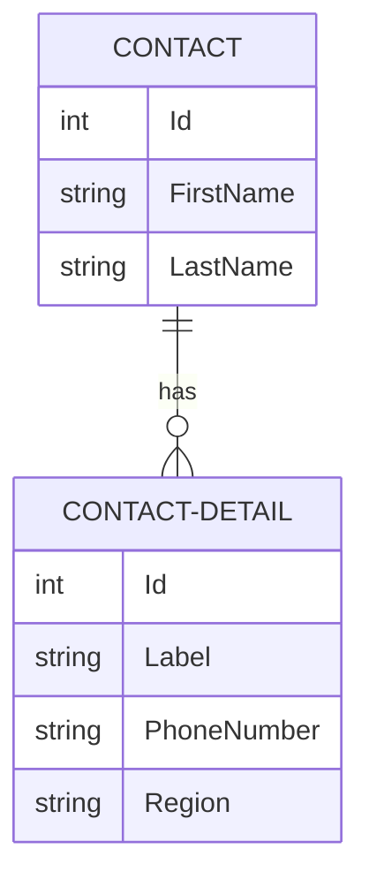

# all-my-friends

## Description

Full Stack Phone Book App using React.js & .NET Core

## Tech Stack

- React.js (Frontend)
- ASP.NET Core 8.0 (Backend)
- PostgreSQL (Database)
- Entity Framework Core
- Bootstrap (UI Styling)

## Installation

### Pre-requisites

Make sure you have the following already installed:
1. [Node.js](https://nodejs.org/)
2. [Dotnet SDK](https://dotnet.microsoft.com/en-us/download/dotnet/8.0)
3. [PostgreSQL](https://www.postgresql.org/)

### App Setup
1. Clone the [Github Repo](https://github.com/MRLmic/all-my-friends).
2. Make sure Postgres is running and make note of the port it is using.
3. Setup your `appSettings.json` file in the root directory, ensuring your connection string has correct values for your Username, Password, and Port.
4. Navigate to the client directory and run `npm install` to make sure front end dependencies are installed and available.
5. Navigate to the server directory and run `dotnet build` to make sure back end packages are available and run the compiler.

### App Startup
To start the app:
1. Run `npm run dev` from the `client` directory to start the frontend.
   - The frontend will be served at `http://localhost:5173` by default.
2. Run `dotnet run` from the root of the `server` directory to start the backend.
   - The backend will be available at `http://localhost:5265`.

The backend will create and seed a database on startup in the development environment if your connection string is set up correctly and your user has the necessary permissions.

## API Documentation

### Base URL
`http://localhost:5265/api/contacts`

### Endpoints

#### 1. Get All Contacts
- **Method**: `GET`
- **URL**: `/api/contacts`
- **Response**: Returns a list of all contacts.

#### 2. Get Contact by ID
- **Method**: `GET`
- **URL**: `/api/contacts/{id}`
- **Response**: Returns the contact with the specified ID.

#### 3. Create a New Contact
- **Method**: `POST`
- **URL**: `/api/contacts`
- **Response**: Returns the created contact.

#### 4. Update a Contact
- **Method**: `PUT`
- **URL**: `/api/contacts/{id}`
- **Response**: Returns the updated contact.

#### 5. Delete a Contact
- **Method**: `DELETE`
- **URL**: `/api/contacts/{id}`
- **Response**: Returns `204 No Content` if successful.

#### For request body examples, see the Swagger info below

### ERD

### Development Tools
- To see available API endpoints, including request body structure, expected return and other relevant info, 
with the app running locally, navigate to the [swagger](https://swagger.io/) API documentation [here](http://localhost:5265/swagger/index.html)

### Additional Features

- Phone number validation and international formatting
- Responsive design for mobile and desktop
- Confirmation modals for destructive actions

### Frontend Dependencies

- [React Bootstrap](https://react-bootstrap.github.io/) - UI component framework
- [React Phone Number Input](https://gitlab.com/catamphetamine/react-phone-number-input) - Phone input with validation
- [React Icons](https://react-icons.github.io/react-icons/) - Icon components
- [React Device Sizes](https://github.com/mahadev-mandal/react-device-sizes#readme) - Responsive design utilities
- [Axios](https://www.npmjs.com/package/react-axios) - HTTP client for API requests